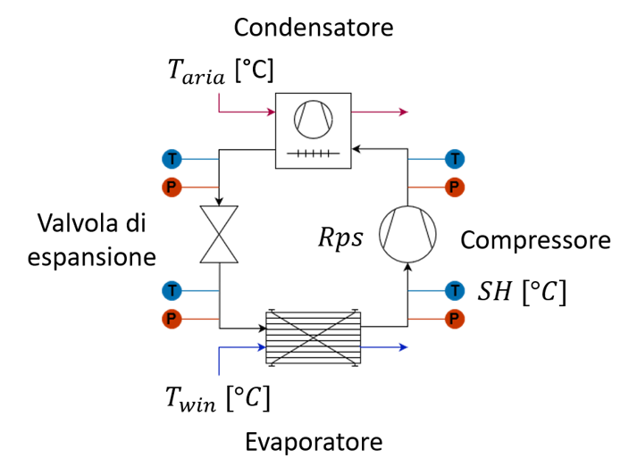

# Digital Twin for Heat Pump Predictive Maintenance

[](https://www.mathworks.com/products/matlab.html)

> A hybrid digital twin system combining physics-based modeling and machine learning for predictive maintenance of heat pump systems.

---

## 📋 Table of Contents

- [Overview](#overview)
- [Key Features](#key-features)
- [System Architecture](#system-architecture)
- [Performance Metrics](#performance-metrics)
- [How It Works](#how-it-works)
- [Contact](#contact)

---

## 🎯 Overview

This project implements a **Digital Twin** for air-source heat pumps designed to enable predictive maintenance and fault detection. The system combines:

- **Physics-based modeling** using MATLAB Simscape for thermodynamic simulation
- **Machine learning** with neural networks trained on synthetic data for anomaly detection
- **Real-time diagnostics** through an intuitive GUI interface

The digital twin can predict system behavior, detect anomalies, and diagnose specific faults such as refrigerant leakage and condenser fouling before they lead to system failures.
Leveraging the physics-based model we generated a synthetic dataset of over 1,000 stationary operating conditions and trained a neural network to improve computational performance and integration with PLCs and GUIs.

<table>
  <tr>
    <td align="center">
      
      <br>
      <b>Refrigerant Cycle</b>
    </td>
    <td align="center">
      
      <br>
      <b>Digital Twin Architecture</b>
    </td>
  </tr>
</table>

### 🎓 Academic Context

This project was developed as part of my **Master's Thesis** in Mechanical Engineering at the University of Padua in collaboration with Aermec Spa's R&D department.

---

## ✨ Key Features

### 🔬 Physics-Based Modeling
- Thermodynamic model of complete vapor-compression cycle
- Component-level simulation (compressor, evaporator, condenser, expansion valve)
- High accuracy: **RMSE < 3K** for temperatures, **< 7%** for pressures and powers
- Validated across multiple operating conditions

### 🧠 Machine Learning Integration
- Neural network trained on 1000+ synthetic scenarios generated by the Physics-Based Model
- Hybrid modeling approach combining physics and data-driven methods
- Fast inference (< 50ms) for real-time diagnostics

### 🚨 Fault Detection & Diagnosis
- **Refrigerant leakage detection**: identifies undercharge ≥ 10%

### 💻 User Interface
- MATLAB GUI for non-technical users
- Real-time visualization of system state
- Alert system with severity levels
- PDF report generation

---

## 🏗️ System Architecture

                     ┌──────────────────┐
                     │  Physical Layer  │
                     │                  │
                     │  • Simscape      │
                     │  • Thermodynamics│
                     │  • Components    │
                     └──────────────────┘
                              │
                              ▼
                     ┌─────────────────────┐
                     │  Synthetic Database │
                     │                     │
                     │  • 1000+ simulations│
                     └─────────────────────┘
                              │
                              ▼
                     ┌──────────────────┐
                     │  Neural Network  │
                     │                  │
                     │  • Matlab        │
                     │  • Training      │
                     │  • Testing       │
                     └──────────────────┘


### Components Details

#### 1. Physical Layer (Simscape Model)
- **Compressor**: Scroll compressor with volumetric and isentropic efficiency maps
- **Evaporator**: Plate heat exchanger with finite volume discretization
- **Condenser**: Finned-tube heat exchanger with air-side modeling
- **Expansion Valve**: Electronic expansion valve with controllable opening

#### 2. ML Layer (Neural Network)
- **Architecture**: 2-layer feedforward network 
- **Input**: 4 features (operating conditions)
- **Output**: 10+ features (pressure, temperatures, powers)
- **Training**: 1000+ synthetic samples under different oeprating conditions

---

## 📊 Performance Metrics

### Model Accuracy

| Metric | Value | Notes |
|--------|--------|--------|
| **Temperature RMSE** | 0.31–3.02 K | Always < 3.1 K (max at condenser inlet, min at evaporator outlet) |
| **Pressure RMSE** | 0.118–0.949 bar | Always < 0.95 bar (≈5.2% RRMSE) |
| **Evaporator Power RMSE** | 960 W | ≈ 6.9% relative error |
| **Compressor Power RMSE** | 195 W | ≈ 5.5% relative error |
| **Operating Range Sensitivity** | Accuracy decreases outside nominal envelope | Digital twin less reliable off-design |

### Fault Detection Performance

| Fault Type | Detection Threshold | Notes |
|-----------|----------------------|--------|
| **Refrigerant Leakage** | Detectable from ≥ 20% loss | <10% loss cannot be detected |
| **Fouling / Blockages** | Detectable only with significant impact | Minor anomalies remain undetected |
| **General Behavior** | Detects deviation from nominal values | Requires operator interpretation |

### Computational Performance

- **Simscape simulation**: ~30 seconds per scenario  
- **Neural network inference**: < 50 ms   

---

## 🔍 How It Works

### Step 1: Physical Modeling

The Simscape model simulates the thermodynamic behavior of the heat pump:

1. **Refrigerant cycle**: R410A properties from REFPROP database
2. **Energy balance**: Conservation of mass and energy at each component
3. **Heat transfer**: Correlations for convection and phase change
4. **Control logic**: PID controllers for superheat and subcooling

### Step 2: Data Generation

The physical model generates training data:

- **Nominal conditions**: 1,000 scenarios across operating range
- **Fault scenarios**: 36 experimental tests under different operating conditions and refrigerant undercharge from 10% to 40%

### Step 3: Neural Network Training

```matlab
% Pseudo-code for training pipeline
data = generate_training_data(physical_model, n_samples=10000);
[X_train, X_val, X_test] = split_data(data, [0.7, 0.15, 0.15]);

net = create_neural_network([128, 64, 32]);
net = train_network(net, X_train, X_val, ...
                     epochs=200, ...
                     optimizer='adam', ...
                     learning_rate=0.001);

performance = evaluate(net, X_test);
```

### Step 4: Real-Time Inference

1. Sensor data is fed to the neural network
2. Neural network provides detailed component-level insights
3. Neural network provides fast anomaly detection
4. Results are displayed in the GUI

---

## 📧 Contact

**Alberto Caprini**
- 📧 Email: albertocaprini99@gmail.com
- 💼 LinkedIn: [linkedin.com/in/albertocaprini](https://www.linkedin.com/in/albertocaprini)
- 🌐 Portfolio: [yourusername.github.io](https://yourusername.github.io)

**Project Link**: [https://github.com/yourusername/digital-twin-heat-pump](https://github.com/yourusername/digital-twin-heat-pump)

---

## 🙏 Acknowledgments

- **Aermec Spa** - R&D Department for providing resources and test facilities
- **University of Padua** - Department of Industrial Engineering for academic supervision
- **Advisor**: Prof. [Benini] - For guidance and support throughout the project
- **Colleagues** at Aermec for technical discussions and feedback

---

## 📚 References

If you use this work in your research, please cite:

```bibtex
@mastersthesis{caprini2024digital,
  title={Digital Twin for Heat Pump Predictive Maintenance: 
         A Hybrid Physics-ML Approach},
  author={Caprini, Alberto},
  year={2024},
  school={University of Padua},
  type={Master's Thesis}
}
```
---

<div align="center">

**⭐ If you find this project useful, please consider giving it a star! ⭐**

Made with ❤️ by Alberto Caprini

</div>
